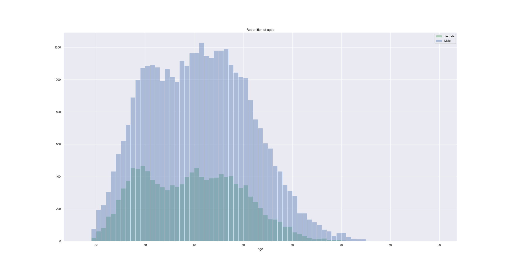

# Some data about Le Marathon de Paris 2019
by Thibaut Vercueil

## Context
* Marathon took place in Paris on 14th of April 2019
* Weather was clear sky, with temperature ranging from 1 to 9 degrees during the race
* 6 people were in space at that time
* Notre Dame de Paris still had a roof
* Average distance ran by finishers : **42.195 kms**

## Participants

* 60000 signed up
* 49155 on departure line
* 48032 finishers 
* 1123 	withdrawal

## Age

Youngest participant is 5 years old. Her name is Lou-Ann, she has FoxG1 syndrome and participated with her father Nicolas [link](https://www.lejdd.fr/Sport/marathon-de-paris-il-court-pour-sa-fille-et-contre-la-maladie-3849674)

Oldest participant is 89 years old. His name is Charly, he finihed in 5 hours, 22 minutes 56 seconds. Not bad.

### Distribution 

